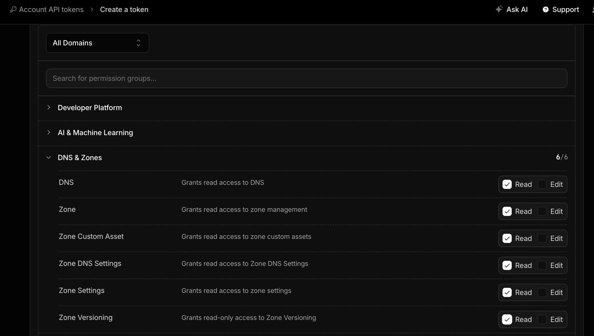

<p align="center">
  
</p>

# Cloudflare Backup

A bash script that uses the Cloudflare API to export and back up DNS records for all zones in your account. Records are saved as timestamped `.txt` files in a local `/domains` directory.

---

## Features

- Automatically fetches **all zones** in your Cloudflare account (handles pagination)
- Exports DNS records for every domain in BIND-compatible format
- Saves each export as `domainname_YYYYMMDD_HHMMSS.txt` for easy versioning
- Reads credentials from a `.env` file — no secrets hardcoded in the script
- Minimal dependencies: `bash`, `curl`, and `jq`

---

## Prerequisites

| Tool | Purpose |
|------|---------|
| `bash` | Script runtime |
| `curl` | API requests to Cloudflare |
| `jq` | JSON parsing |

Install `jq` if needed:

```bash
# macOS
brew install jq

# Ubuntu / Debian
sudo apt-get install jq

# RHEL / CentOS
sudo yum install jq
```

---

## Setup

### 1. Clone the repository

```bash
git clone https://github.com/mylesagnew/cloudflare-backup.git
cd cloudflare-backup
```

### 2. Configure credentials

Copy or edit the `.env` file in the project root:

```bash
CLOUDFLARE_API_TOKEN=your_api_token_here
```

> **Where to find your credentials:**  
> Cloudflare Dashboard → My Profile → **API Tokens** → Create Token  
> Use a custom token with **Zone > Zone > Read** and **Zone > DNS > Read** permissions.



### 3. Make the script executable

```bash
chmod +x cf-dns-backup.sh
```

---

## Usage

```bash
./cf-dns-backup.sh
```

The script will:

1. Load credentials from `.env`
2. Fetch all zones (domains) from your Cloudflare account
3. Export DNS records for each domain
4. Write files to `./domains/` with timestamps

**Example output:**

```
Using .env file
Getting List of domains from Cloudflare
=======================================
Fetching batch of 5 DNS records ...
Fetched 5 domains.
Writing domain DNS files
Exported DNS records for domain: example.com
Exported DNS records for domain: mysite.org
Domain DNS records complete. Please check the /domains directory for your files
```

**Example files created:**

```
domains/
├── example.com_20240315_143022.txt
└── mysite.org_20240315_143023.txt
```

---

## File Structure

```
cloudflare-backup/
├── cf-dns-backup.sh   # Main backup script
├── .env               # Cloudflare credentials (not committed)
├── domains/           # Output directory (created automatically)
└── README.md
```

---

## Automating with Cron

Run daily backups at 2am:

```bash
crontab -e
```

```cron
0 2 * * * /path/to/cloudflare-backup/cf-dns-backup.sh >> /var/log/cf-backup.log 2>&1
```

---

## Security Notes

- **Never commit `.env`** — add it to `.gitignore` to avoid exposing your API token
- The script uses a scoped **API Token** with `Zone:Read` and `Zone:DNS:Read` permissions — never grant more than the minimum required

---

## License

This project is licensed under the terms of the [LICENSE](LICENSE) file.
